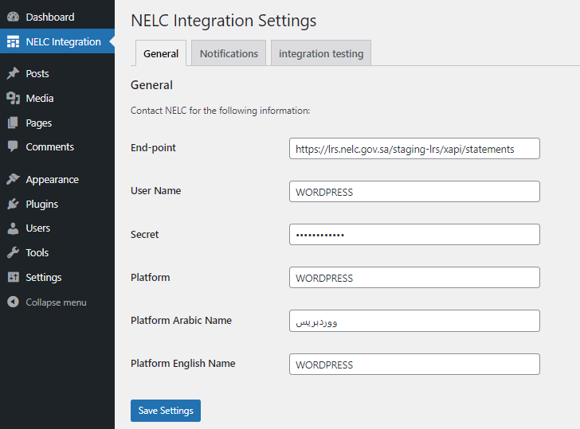
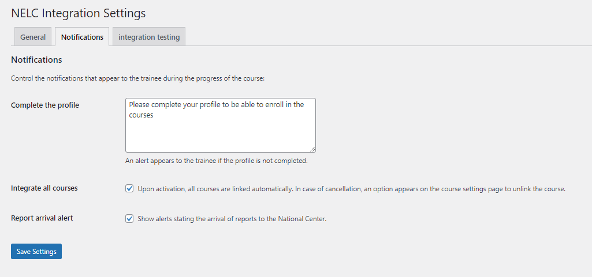
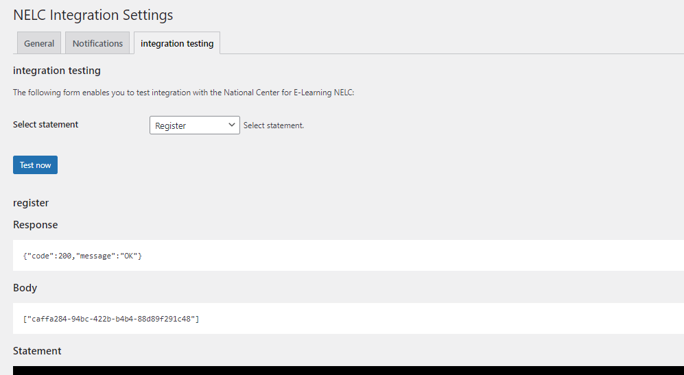

# TutorLms NELC Integration

The TutorLms NELC Integration WordPress plugin is tailored to seamlessly connect with the National Center for E-Learning in Saudi Arabia. It facilitates the transmission of all learner activities, from course registration to certificate attainment, ensuring a smooth and efficient process.

## Description

The TutorLms NELC Integration plugin is designed to link the WordPress TutorLms LMS with the National Center for E-Learning in Saudi Arabia. This plugin enables the automatic transfer of learning activities and data from the TutorLms system to NELC, providing a comprehensive and integrated learning experience.

## Installation

Installing "TutorLms NELC Integration" can be done either by searching for "TutorLms NELC Integration" via the "Plugins > Add New" screen in your WordPress dashboard, or by following these steps:

1. Download the plugin via WordPress.org or GitHub:
   - [GitHub Repository](https://github.com/nelc/tutor-lms-lrs-plugin.git)
2. If downloading from GitHub:
   - Go to the GitHub repository and click on the "Code" button.
   - Select "Download ZIP".
3. Upload the ZIP file through the 'Plugins > Add New > Upload' screen in your WordPress dashboard.
4. Activate the plugin through the 'Plugins' menu in WordPress.
5. Go to the plugin settings page under 'Settings > NELC Integration'.
6. Add the endpoints provided by NELC.
7. Test the connection to ensure everything is set up correctly.

## Screenshots

1. **Settings Page** - Settings page where you can configure NELC endpoints and other options.

2. **Notifications settings** - Notification settings tab and options to link courses or not.

3. **Testing tab** -Check the success of the connection with NELC and make sure that the data is flowing to their servers properly.

## Frequently Asked Questions

### What is the plugin for?

This plugin is specifically crafted to streamline integration with NELC, providing seamless connectivity and enhancing functionality.

## Changelog

### 1.0.0

* 2023-11-28
* Initial release

## Upgrade Notice

### 1.0.0

* 2023-11-28
* Initial release
